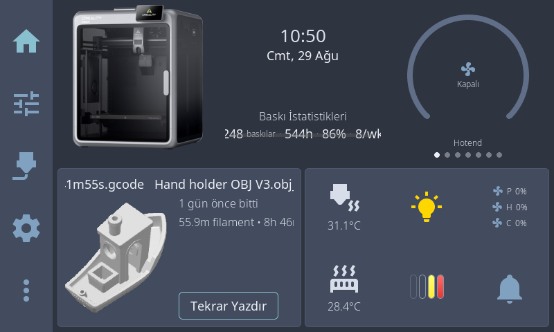
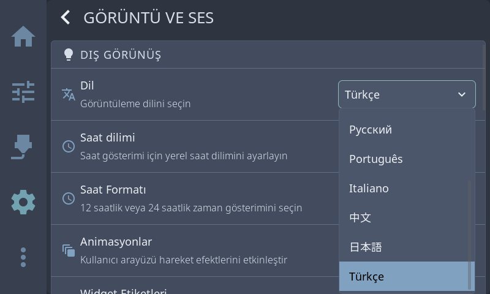
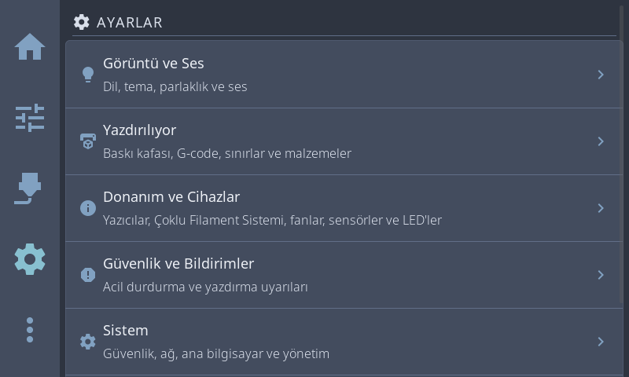
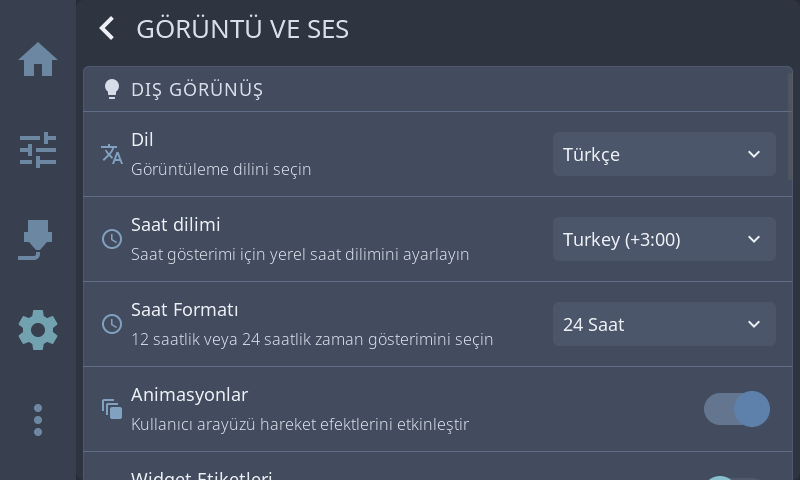
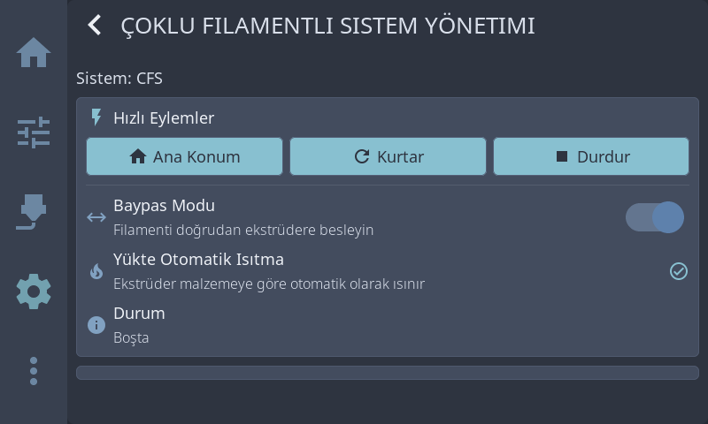

<p align="center">
  
</p>

<h1 align="center">K2 Pro için Türkçe HelixScreen</h1>

<p align="center">
  Creality K2 Pro ekranında seçilebilir, UTF-8 destekli Türkçe arayüz ve CFS desteği.
</p>

<p align="center">
  <a href="https://github.com/QUINRY/helixscreen-k2-pro-turkce/releases/latest"></a>
  <a href="https://github.com/QUINRY/helixscreen-k2-pro-turkce/releases/latest"></a>
  <a href="LICENSE"></a>
  
</p>



Bu çalışma, [HelixScreen](https://github.com/prestonbrown/helixscreen) projesinin Creality K2 Pro için hazırlanmış topluluk sürümüdür. Türkçe, ekranın dil menüsünden seçilebilir; CFS işlevleri korunur. Kurucu yazıcının durumunu denetler, paketin SHA-256 özetini doğrular ve baskı sırasında çalışmayı reddeder.

> [!IMPORTANT]
> Yalnızca **Creality K2 Pro** üzerinde ve HelixScreen **0.99.118** tabanı ile test edildi. Kurulum için yazıcıda Root Erişimi ve SSH açık olmalıdır. İşleme başlamadan önce yazıcının boşta olduğundan emin olun.

## Özellikler

- Arayüzde seçilebilir **Türkçe** dili
- 2.855 çevrilmiş metin ve UTF-8 Türkçe karakter desteği
- Creality CFS ekranları ve çoklu filament iş akışları
- Mevcut uyumlu HelixScreen kurulumunda ayarları koruyan, geri alınabilir Türkçe katman
- HelixScreen kurulu değilse otomatik tam kurulum
- Mevcut ekran ve ayarlar için otomatik geri dönüş yedeği
- Paket bütünlüğü, cihaz mimarisi, Moonraker ve baskı durumu kontrolleri
- Tek komutla güncelleme ve kaldırma

## Hızlı kurulum

Yazıcının IP adresini bulun ve aşağıdaki komutta `YAZICI_IP` bölümünü değiştirin. MobaXterm, Linux veya macOS terminalinde:

```bash
curl -fsSL https://raw.githubusercontent.com/QUINRY/helixscreen-k2-pro-turkce/main/install.sh \
  | ssh root@YAZICI_IP 'sh -s -- --yes'
```

Windows PowerShell kullanıyorsanız:

```powershell
curl.exe -fsSL https://raw.githubusercontent.com/QUINRY/helixscreen-k2-pro-turkce/main/install.sh |
  ssh root@YAZICI_IP "sh -s -- --yes"
```

SSH parolası istendiğinde yazıcının **Root hesabı** ekranında gösterilen parolayı girin. Kurulum tamamlandığında HelixScreen yeniden başlatılır ve Türkçe seçilir.

Kurucu otomatik olarak doğru yolu seçer:

| Yazıcının mevcut durumu | Yapılan işlem | Kaldırıldığında |
| --- | --- | --- |
| HelixScreen 0.99.118 kurulu | Yalnız Türkçe katman uygulanır; ekran ve CFS ayarları korunur | Önceki HelixScreen geri gelir |
| HelixScreen kurulu değil | Türkçe tam K2 paketi kurulur | Stok Creality arayüzü geri gelir |

### Ön kontrol

Değişiklik yapmadan uyumluluğu denetlemek için:

```bash
curl -fsSL https://raw.githubusercontent.com/QUINRY/helixscreen-k2-pro-turkce/main/install.sh \
  | ssh root@YAZICI_IP 'sh -s -- --check'
```

### Güncelleme

Resmî HelixScreen güncellemesi Türkçe dosyaları kaldırırsa, bu projenin yeni uyumlu sürümü yayınlandıktan sonra hızlı kurulum komutunu yeniden çalıştırmanız yeterlidir. Kurucu güncel resmî sürüm için yeni bir geri dönüş yedeği oluşturur; eski sürümün yedeğini yanlışlıkla kullanmaz. Uyumlu olmayan bir HelixScreen sürümü algılanırsa dosyalara dokunmadan durur.

## Kaldırma

MobaXterm, Linux veya macOS terminalinde:

```bash
curl -fsSL https://raw.githubusercontent.com/QUINRY/helixscreen-k2-pro-turkce/main/remove.sh \
  | ssh root@YAZICI_IP 'sh -s -- --yes'
```

Windows PowerShell'de:

```powershell
curl.exe -fsSL https://raw.githubusercontent.com/QUINRY/helixscreen-k2-pro-turkce/main/remove.sh |
  ssh root@YAZICI_IP "sh -s -- --yes"
```

Kaldırmadan önce yalnız kontrol yapmak için son parametreyi `--check` olarak değiştirin. Kurulumdan önce oluşturulan yedekler `/mnt/UDISK/helixscreen-turkish-backups/` altında tutulur.

## Çevrimdışı kurulum

[Son sürüm](https://github.com/QUINRY/helixscreen-k2-pro-turkce/releases/latest) sayfasından uygun paketi indirin:

- Mevcut HelixScreen 0.99.118 için: `helixscreen-k2-tr-overlay.zip`
- HelixScreen kurulu olmayan K2 Pro için: `helixscreen-k2.zip`

Paketi yazıcıya kopyalayın ve kurucuyu yerel dosyayla çalıştırın:

```bash
scp helixscreen-k2-tr-overlay.zip root@YAZICI_IP:/mnt/UDISK/
curl -fsSL https://raw.githubusercontent.com/QUINRY/helixscreen-k2-pro-turkce/main/install.sh \
  | ssh root@YAZICI_IP 'sh -s -- --local /mnt/UDISK/helixscreen-k2-tr-overlay.zip --yes'
```

HelixScreen yazıcıda yoksa aynı komutta tam paket adını kullanın. Kurucu yanlış paket seçilirse SHA-256 kontrolünde güvenli biçimde durur.

## Ekran görüntüleri

| Dil seçimi | Ayarlar |
| --- | --- |
|  |  |

| Görüntü ayarları | CFS yönetimi |
| --- | --- |
|  |  |

## Gereksinimler ve güvenlik

- Creality K2 Pro; `armv7l` sistem ve erişilebilir Moonraker
- Yazıcının ayarlarından etkinleştirilmiş Root Erişimi/SSH
- Boşta, tamamlanmış, iptal edilmiş veya hata durumundaki yazıcı
- Paketleri indirmek için internet erişimi; çevrimdışı yöntemde yalnız yerel ağ

Kurucu `printing` veya `paused` durumunda çalışmaz. G-code dosyalarını değiştirmez veya silmez. `--force-print-state` seçeneği yalnız Moonraker durumu bilinçli olarak denetlenemediğinde kullanılmalıdır.

## Sorun giderme

Önce değişiklik yapmayan kontrolü çalıştırın:

```bash
curl -fsSL https://raw.githubusercontent.com/QUINRY/helixscreen-k2-pro-turkce/main/install.sh \
  | ssh root@YAZICI_IP 'sh -s -- --check'
```

- `Permission denied`: K2 Pro'da Root Erişimi'ni tekrar açın ve ekranda gösterilen güncel parolayı kullanın.
- `Yazıcı şu anda printing/paused`: Baskının bitmesini veya güvenli biçimde iptal edilmesini bekleyin.
- `Mevcut HelixScreen sürümü uyumlu değil`: Bu sürüm yalnız 0.99.118 tabanını destekler; dosyalar değiştirilmez.
- Arayüz açılmıyorsa yazıcıyı yeniden başlatın. Sorun sürerse kaldırma komutu önceki arayüzü geri yükler.

Bir hata bildirirken komut çıktısını, K2 Pro yazılım sürümünü ve HelixScreen sürümünü paylaşın; SSH parolanızı paylaşmayın.

## Paket doğrulama

`v0.99.118-tr.1` sürümünün SHA-256 değerleri:

| Dosya | SHA-256 |
| --- | --- |
| `helixscreen-k2-tr-overlay.zip` | `f223e4de63b5568fcf60c90bc97fe2f3d4b45ff247918204820968b4d1f5eac7` |
| `helixscreen-k2.zip` | `1b39a6992648a3eae8e519bbdbb327f9ea2c0da38833478e4f0ab288e96990d1` |

Aynı özetler sürüm varlıklarındaki `SHA256SUMS` dosyasında da bulunur ve kurucu tarafından otomatik denetlenir.

## Kaynak ve lisans

Bu depo, Preston Brown ve HelixScreen katkıcılarının [özgün projesini](https://github.com/prestonbrown/helixscreen) temel alır. Kaynak kod ve Türkçe değişiklikler [GNU GPLv3](LICENSE) ile lisanslanmıştır. Bu, Creality tarafından yayımlanan veya desteklenen resmî bir ürün değildir.

Çeviri veya K2 Pro uyumluluğu için katkılar ve hata bildirimleri memnuniyetle karşılanır.
